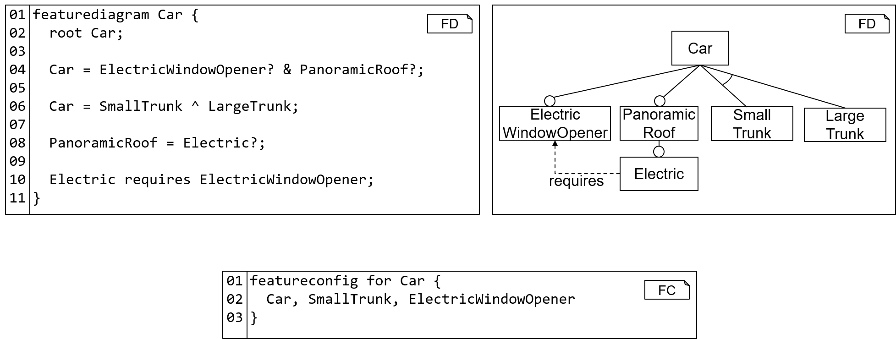

<!-- (c) https://github.com/MontiCore/monticore -->
[clitool]:                   ../../../../../../../../fd-analysis/src/main/java/mcfdtool/FACT.java
[fddifftool]:                ../../../../../../../../fd-analysis/src/main/java/fddiff/FDSemDiff.java
[FDtool]:                    ../../../../../../../../fd-lang/src/main/java/de/monticore/featurediagram/FeatureDiagramCLI.java
[FCtool]:                    ../../../../../../../../fd-lang/src/main/java/de/monticore/featureconfiguration/FeatureConfigurationCLI.java
[PFCtool]:                    ../../../../../../../../fd-lang/src/main/java/de/monticore/featureconfigurationpartial/FeatureConfigurationPartialCLI.java
[SemDiffPaper]:              https://se-rwth.de/publications/Semantic-Evolution-Analysis-of-Feature-Models.pdf

[flatzinc]: https://www.minizinc.org/doc-2.4.3/en/flattening.html
[choco]: https://choco-solver.org
> NOTE: <br>
This documentation is intended for  **modelers** who use the feature diagram languages.
The documentation for **language engineers** using or extending the feature diagram language is 
located **[here](fd-lang/src/main/grammars/de/monticore/FeatureDiagram.md)** and the
documentation for using 
or extending the feature configuration language is located 
**[here](fd-lang/src/main/grammars/de/monticore/FeatureConfiguration.md)**.

# Feature Diagram Languages in MontiCore

[[_TOC_]]

The models of the feature diagram language (FDL) are called *feature diagrams (FDs)*. Sometimes
the term feature model is used interchangeably. 
An FD describes a software or system family in terms of 
(user-experienceable) features. FDs are used as variability models in
the context of software product lines. *Feature configurations (FCs)* select features
of a feature diagram and specify a product (or variant) of the product lines.
This documentation does not provide a general holistic introduction to FDs
and their applications, as this is provided by several books (e.g., 
[[CE00]](https://dl.acm.org/doi/book/10.5555/345203), 
[[CN02]](https://dl.acm.org/doi/book/10.5555/501065)) and 
research papers (e.g., 
[[BSL+13]](http://citeseerx.ist.psu.edu/viewdoc/download?doi=10.1.1.650.9121&rep=rep1&type=pdf), 
[[KCH+90]](https://apps.dtic.mil/dtic/tr/fulltext/u2/a235785.pdf)).

Instead, the purpose of this documentation is to 
introduce the [textual syntax](#textual-syntax) of the FDL and
describe the [tools](#tools) that the FDL provides to process FD models
and to perform analyses on the FDs.

## Project Structure
* [**doc**](doc) contains slides and images used for the documentation of the language
* [**fd-analysis**](fd-analysis) contains several FD analyses and a tool to execute these 
* [**fd-lang**](fd-lang) contains the technical realization of the languages
  * The FD language is documented [here](fd-lang/src/main/grammars/de/monticore/FeatureDiagram.md)
  * The FC languages are documented [here](fd-lang/src/main/grammars/de/monticore/FeatureConfiguration.md)

## Textual Syntax
This section presents two examples for FDs: The phone example gives an overview
over the textual syntax while the CarNavigation presents all syntax elements of the language.

Each FD has a name and a body that is surrounded by curly brackets.
The body contains rules that define the feature tree. Each rule describes a 
feature group with a parent feature (left-hand side) followed by an arrow 
(`->`) and children features (right-hand side). 
The root of the feature tree is detected automatically. 
Further, an FD may define cross-tree constraints
and use Java-like expressions to formulate these.

###### Phone Example 
Fig. 1 presents the textual and graphical syntax of an example FD 
describing a product line of phones.
As in Java, each FD can be located in a package to enable a hierarchical
name space of feature diagrams. Omitting the package statement 
defaults to an empty package.

<div align="center">

<br><b>Figure 1:</b> 
Example for the textual syntax of an FD (left) and its visual 
representation (right). The bottom demonstrates the syntax of a feature
configuration by example.
</div><br>


The content of the FD begins with the keyword `featurediagram` followed 
by the FD's name (l. 3) and the FD body, enclosed by curly 
braces. 
The body of an FD must contain a statement introducing the root feature (l. 4).
Further, it can introduce subfeatures through feature groups (ll. 5-9) and 
cross-tree constraints (ll.11-12).

Feature configurations start with the keyword `featureconfig` followed by an optional
name of the feature configuration. Afterward, the feature configuration has to 
indicate, which FD it belongs to. This begins with the keyword `for`, followed
by the (qualified) name of the FD.
The body of the feature configuration, enclosed in curly braces, contains a comma-separated
list of selected feature names. 
Please note that this syntax for feature configurations does not distinguish between 
features that are not selected (yet) and features, which are "unselected". To this end, 
a different feature configuration language has to be employed, e.g., to model step-wise configuration
of FDs.

###### CarNavigation Example 

```
/* (c) https://github.com/MontiCore/monticore */
featurediagram CarNavigation {

  CarNavigation -> Display & GPS & PreinstalledMaps? & Memory ; //and group

  CarNavigation -> VoiceControl ^ TouchControl; //xor group

  Memory -> Small ^ Medium ^ Large ;

  Display -> SmallScreen | LargeScreen; //or group

  PreinstalledMaps -> [1..3] of {Europe, NorthAmerica, SouthAmerica, Asia, Africa}; //cardinality group

  TouchControl requires LargeScreen ;

  SmallScreen  excludes TouchControl ;

  (Europe && NorthAmerica && Asia) requires (Large || Medium) ;

}
``` 
The listing above presents the FD `CarNavigation` with the root
feature also named `CarNavigation`. This feature has three mandatory
subfeatures `Display`, `GPS`, and `Memory`. Further, it
has the optional subfeature `PreinstalledMaps`, indicated by the question 
mark in the and group. Besides these four subfeatures, `CarNavigation` has
two further subfeatures `VoiceControl` and `TouchControl`that are in an 
xor group, which means that each configuration must contain exactly one of 
these two features.
Groups can have arbitrary members. For instance, `Memory` has three
subfeatures `Small`, `Medium`, and `Large` that are in a common xor group.
The `Display` of the navigation must have either a `SmallScreen` behin the 
steering wheel or a `LargeScreen` (e.g., in the center of the dashobard),
or both. This is realized as an or group in the FD. 
Further, the navigation system can have preinstalled maps. If maps are preinstalled,
at least one and at most three region maps can be selected. 
The available regions are `Europe`, `NorthAmerica`, `SouthAmerica`, `Asia`, and 
`Africa`.

The FD further contains three cross-tree constraints. Selecting 
`TouchControl` in a configuration requires also to select `LargeScreen` for
this configuration. On the other hand, selecting `SmallScreen` in a configuration
prohibits selecting `TouchControl` in the same configuration as well. 
Apart from these constraints between two features, FDs may contain
more complex constraints that involve more than two features. In the example 
FD below, selecting all three preinstalled maps  `Europe`, `NorthAmerica`, 
and `Asia` requires to select either a `Large` or a `Medium` memory.


## Tool Set Up
This section explains how to set up the command line interface tools for the FD languages.
Each tool is contained in a separate jar file, which is produced as result
of building the project with gradle. The following explains this.

##### Prerequisites
To build the project, it is required to install a Java 8 JDK and git. 

##### Step 1: Clone Project with git

    git clone <link to this Git repository>
    cd feature-diagram

##### Step 2: Build Project with gradle

    gradlew build --refresh-dependencies
Afterwards, the jars of the tools are available in `fd-lang/target/libs` and `fd-analysis/target/libs`.


## Tools
The FDL component provides the five tools that are explained in more detail below:
* The [Feature Model Analysis CLI Tool (FACT)][clitool] enables executing analyses against feature diagrams and feature configuration both via CLI and Java API
* The [FeatureDiagramCLI][FDtool] enables fine-grained options for processing feature diagram models both via CLI and Java API
* The [FeatureConfigurationCLI][FCtool] enables fine-grained options to process feature configuration models both via CLI and Java API
* The [FeatureConfigurationPartialCLI][PFCtool] enables fine-grained options to process partial feature configuration models both via CLI and Java API
* The [Semantic Differencing for Feature Diagrams][fddifftool] enables performing the semantic difference operator for feature diagrams via Java API. 

### [The FeatureModelAnalysisCLITool][clitool] 
The [Feature Model Analysis CLI Tool (FACT)][clitool] coordinates the execution of one or more several analyses against a FD
and, optionally, additional information (depends on the analysis kinds) in form of a CLI tool. 
An overview of the different analyses is given by [[BSRC10]](https://www.sciencedirect.com/science/article/abs/pii/S0306437910000025?via%3Dihub).

FACT can be used as follows:
`java -jar FACT.jar <Car.fd> [-<analysis>]+`, where
* `<Car.fd>` is the (optionally, qualified) fileName of an FD "Car"
* `<analysis>` is the name of an analysis followed by arguments for the analysis that depend on the type of analysis.

Currently, the FeatureModelAnalysisCLITool supports the following analyses:
* `isValid <Basic.fc>`, to check whether a passed configuration "Basic" is valid w.r.t the FD
* `allProducts`, to find all valid configurations of the FD
* `deadFeatures`, to find all features of FD that are not included in any valid configuration of FD
* `falseOptional`, to find all optional features of FD that are included in every valid vonfiguration of FD
* `completeToValid <Basic.fc>`, to complete the passed configuration "Basic" to a valid configuration, if this is possible
* `findValid`, to find any valid configuration of FD
* `isVoidFeatureModel`, to check whether there is at least one valid configuration of FD
* `numberOfProducts`, to count the number of valid configurations of FD
* `semdiff <semantics>`, to compute a diff witness contained in the semantic difference from an FD to another FD using 
  the semantics as specified by the argument `<semantics>`. Possible values for the argument are `open` and `closed` where 
  `open` is chosen by default if no argument is specified. The differences between the open- and closed-world semantics are
   described [in this paper][SemDiffPaper] in detail. 

For example, `java -jar FACT.jar Car.fd -isValid Basic.fc` checks whether a configuration "Basic" is a valid configuration of the FD "Car". 
The result, in this case `true` or `false`, is printed to the console.
Currently, `semdiff` is the only option that expects two FDs as inputs. 
For example, `java -jar FACT.jar Car1.fd Car2.fd -semdiff open` computes and outputs a diff witness 
contained in the open-world semantic difference from `Car1.fd` to `Car2.fd` if at least one exists.
Otherwise, the tool outputs that `Car1.fd` is a refinement of `Car2.fd`.

[FACT][clitool] can further be used for direct access from Java through the following methods:
* `boolean execIsValid(ASTFeatureDiagram fd, ASTFeatureConfiguration fc)`, to execute the [is valid](fd-analysis/src/main/java/tool/analyses/IsValid.java) analysis
* `List<ASTFeatureConfiguration> execAllProducts(ASTFeatureDiagram fd)`, to execute the [all products](fd-analysis/src/main/java/tool/analyses/AllProducts.java) analysis
* `List<String> execDeadFeature(ASTFeatureDiagram fd)`, to execute the [dead features](fd-analysis/src/main/java/tool/analyses/DeadFeatures.java) analysis
* `List<String> execFalseOptional(ASTFeatureDiagram fd)`, to execute the [false optional features](fd-analysis/src/main/java/tool/analyses/FalseOptional.java) analysis
* `ASTFeatureConfiguration execCompleteToValid(ASTFeatureDiagram fd, ASTFeatureConfiguration fc)`, to execute the [filter](fd-analysis/src/main/java/tool/analyses/Filter.java) analysis
* `ASTFeatureConfiguration execFindValid(ASTFeatureDiagram fd)`, to execute the [find valid product](fd-analysis/src/main/java/tool/analyses/FindValidConfig.java) analysis
* `boolean execIsVoidFeatureModel(ASTFeatureDiagram fd)`, to execute the [is void](fd-analysis/src/main/java/tool/analyses/IsVoidFeatureModel.java) analysis
* `int execNumberOfProducts(ASTFeatureDiagram fd)`, to execute the [number of products](fd-analysis/src/main/java/tool/analyses/NumberOfProducts.java) analysis
* `ASTFeatureDiagram readFeatureDiagram(String modelFile, String symbolOutPath, ModelPath symbolInputPath)`, to read in a feature diagram model
* `ASTFeatureConfiguration readFeatureConfiguration(String modelFile, ModelPath symbolInputPath)`, to read in a feature configuration model

Example:
```groovy
FACT tool = new FACT();
ModelPath mp = new ModelPath();
mp.addEntry(Paths.get("target"));

ASTFeatureDiagram fd = tool.readFeatureDiagram("src/test/resources/fdvalid/CarNavigation.fd", "target", mp);
ASTFeatureConfiguration fc = tool.readFeatureConfiguration("src/test/resources/Basic.fc", mp);
boolean result = tool.execIsValid(fd, fc);

if(result){
  System.out.println("Is valid!");
}
else{
  System.out.println("Is invalid!");
}
```

### [The FeatureDiagramCLI Tool][FDtool] 
The [FeatureDiagramCLI][FDtool] offers both CLI and a Java API for processing FeatureDiagram models. 
It provides through the CLI as follows:

`java -jar FeatureDiagramCLI.jar [-h] -i <fileName> [-o <outPath>] [-path <p>] [-pp [<file>]] [-s [<file>]]`
        
where the arguments are:
* `-h`,`--help`                  Prints this help dialog
* `-i`,`--input <fileName>`      Reads the (mandatory) source file resp. the contents of the model
* `-o`,`--output <outPath>`      Path of generated files
* `-path <p>`                    Sets the artifact pathlist for imported symbols. 
                                 The pathlist is separated by colons (':').
* `-pp`,`--prettyprint [<file>]` Prettyprints the model to stdout or a specified output file
* `-s`,`--symboltable [<file>]`  Serializes and prints the symbol table either to stdout or to a
                                 specified output file

For using the tool as Java API, it contains the following methods:
* `ASTFDCompilationUnit parse(String modelFile)` processes the model at the passed path and produces an AST
* `IFeatureDiagramArtifactScope createSymbolTable(String modelFile, ModelPath mp)` parses the model at 
  the passed path and instantiates the symbol table using passed modelpath entries for finding imported FDs
* `IFeatureDiagramArtifactScope createSymbolTable(ASTFDCompilationUnit ast, ModelPath mp)` instantiates the 
  symbol table using the passed AST as basis and the passed modelpath entries for finding imported FDs
* `void checkCoCos(ASTFDCompilationUnit ast)` checks all context conditions of the FDL against the passed AST
* `String storeSymbols(IFeatureDiagramArtifactScope scope, String fileName)` stores the symbol table 
  for the passed artifact scope in a file with the passed fileName. If the file exists, it is overridden. 
  Otherwise, a new file is created.
* `String storeSymbols(IFeatureDiagramArtifactScope scope, Path out)` stores the symbol table for 
  the passed artifact scope in a file with the usual name, package, and fileEnding at the passed 
  'out' location. If the file exists, it is overridden. Otherwise, a new file is created.
* `ASTFeatureDiagram run(String modelFile, Path out, ModelPath mp)` parses the passed modelFile, creates the 
  symbol table, checks the context conditions, and then stores the symbol table at the passed location.
* `ASTFeatureDiagram run(String modelFile, ModelPath mp)` parses the passed modelFile, creates the 
  symbol table, checks the context conditions, and then stores the symbol table.
* `ASTFeatureDiagram run(String modelFile)` parses the passed modelFile, creates the symbol table, 
  checks the context conditions, and stores symbol table - all without an explicit modelpath. Care: 
  this can only take into account imported FDs if these are located next to the passed FD modelFile.

### [The FeatureConfigurationCLI Tool][FCtool] 
The [FeatureConfigurationCLI][FCtool] offers both CLI and a Java API for processing FeatureConfiguration models. 
It provides through the CLI as follows:

`java -jar FeatureConfigurationCLI.jar [-h] -i <fileName> [-o <outPath>] [-path <p>] [-pp [<file>]] [-s [<file>]]`
        
where the arguments are:
* `-h`,`--help`                  Prints this help dialog
* `-i`,`--input <fileName>`      Reads the (mandatory) source file resp. the contents of the model
* `-o`,`--output <outPath>`      Path of generated files
* `-path <p>`                    Sets the artifact pathlist for imported symbols.
                                 The pathlist is separated by colons (':').
* `-pp`,`--prettyprint [<file>]` Prettyprints the model to stdout or a specified output file
* `-s`,`--symboltable [<file>]`  Serializes and prints the symbol table either to stdout or to a
                                 specified output file

For using the tool as Java API, it contains the following methods:
* `ASTFCCompilationUnit parse(String modelFile)` processes the model at the passed path and produces an AST
* `IFeatureConfigurationArtifactScope createSymbolTable(String modelFile, ModelPath mp)` parses the model at 
  the passed path and instantiates the symbol table using passed modelpath entries for finding FDs
* `IFeatureConfigurationArtifactScope createSymbolTable(ASTFCCompilationUnit ast, ModelPath mp)` instantiates the 
  symbol table using the passed AST as basis and the passed modelpath entries for finding FDs
* `String storeSymbols(IFeatureConfigurationArtifactScope scope, String fileName)` stores the symbol table 
  for the passed artifact scope in a file with the passed fileName. If the file exists, it is overridden. 
  Otherwise, a new file is created.
* `String storeSymbols(IFeatureConfigurationArtifactScope scope, Path out)` stores the symbol table for 
  the passed artifact scope in a file with the usual name, package, and fileEnding at the passed 
  'out' location. If the file exists, it is overridden. Otherwise, a new file is created.
* `ASTFeatureConfiguration run(String modelFile, ModelPath mp)` parses the passed modelFile and creates 
  the symbol table. Through this, conformance to the feature model is checked as well.
* `ASTFeatureConfiguration run(String modelFile)` parses the passed modelFile and creates 
   the symbol table. Through this, conformance to the feature model is checked as well - all without 
   an explicit modelpath. Care: this can only take into account FDs if these are located next to the 
   passed FC modelFile.
   
### [The FeatureConfigurationPartialCLI Tool][PFCtool] 
The [FeatureConfigurationPartialCLI][PFCtool] offers both CLI and a Java API for processing 
PartialFeatureConfiguration models. It provides through the CLI as follows:

`java -jar FeatureConfigurationPartialCLI.jar [-h] -i <fileName> [-o <outPath>] [-path <p>] [-pp [<file>]] [-s [<file>]]`
        
where the arguments are:
* `-h`,`--help`                  Prints this help dialog
* `-i`,`--input <fileName>`      Reads the (mandatory) source file resp. the contents of the model
* `-o`,`--output <outPath>`      Path of generated files
* `-path <p>`                    Sets the artifact pathlist for imported symbols.
                                 The pathlist is separated by colons (':').
* `-pp`,`--prettyprint [<file>]` Prettyprints the model to stdout or a the specified output file
* `-s`,`--symboltable [<file>]`  Serializes and prints the symbol table either to stdout or to a
                                 specified output file

For using the tool as Java API, it contains the following methods:
* `ASTFCCompilationUnit parse(String modelFile)` processes the model at the passed path and produces an AST
* `IFeatureConfigurationPartialArtifactScope createSymbolTable(String modelFile, ModelPath mp)` parses the model at 
  the passed path and instantiates the symbol table using passed modelpath entries for finding FDs
* `IFeatureConfigurationPartialArtifactScope createSymbolTable(ASTFCCompilationUnit ast, ModelPath mp)` instantiates the 
  symbol table using the passed AST as basis and the passed modelpath entries for finding FDs
* `void checkCoCos(ASTFCCompilationUnit ast)` checks all context conditions of the partial FC language
   against the passed AST
* `String storeSymbols(IFeatureConfigurationPartialArtifactScope scope, String fileName)` stores the symbol table 
  for the passed artifact scope in a file with the passed fileName. If the file exists, it is overridden. 
  Otherwise, a new file is created.
* `String storeSymbols(IFeatureConfigurationPartialArtifactScope scope, Path out)` stores the symbol table for 
  the passed artifact scope in a file with the usual name, package, and fileEnding at the passed 
  'out' location. If the file exists, it is overridden. Otherwise, a new file is created.
* `ASTFeatureConfiguration run(String modelFile, ModelPath mp)` parses the passed modelFile and creates 
  the symbol table. Through this, conformance to the feature model is checked as well.
* `ASTFeatureConfiguration run(String modelFile)` parses the passed modelFile and creates 
   the symbol table. Through this, conformance to the feature model is checked as well - all without 
   an explicit modelpath. Care: this can only take into account FDs if these are located next to the 
   passed modelFile.

### [Semantic Differencing for Feature Diagrams][fddifftool]
The [Semantic Differencing for Feature Diagrams Tool][fddifftool] offers a Java API to perform semantic differencing between two 
feature diagrams. The semantics of a feature diagram are the set of all of its valid feature configurations.
The semantic difference between two feature diagram is therefore the set of feature configurations, that are valid in 
the first but invalid in the second feature diagram.
The Java API offers a class to calculate the semantic difference witness, given two parsed feature diagrams.
Simply invoke the `semDiff` method of the `FDSemDiff` class provided [here][fddifftool]. 

## Tool Usage Examples
This section provides some copy and paste templates for executing the resulting tools against 
some test models that are contained in the language project. This is a good basis 
for getting familiar with the tools while experimenting with changes to the models. 
The tools are explained here and the languages are documented there.

#### Print tool argument options
(1) Print argument options of the FACT tool:

    java -jar fd-analysis/target/libs/FACT.jar -h
        
(2) Print argument options of the FD tool:

    java -jar fd-lang/target/libs/FeatureDiagramCLI.jar -h

(3) Print argument options of the FC tool:

    java -jar fd-lang/target/libs/FeatureConfigurationCLI.jar -h

(4) Print argument options of the PartialFC tool:

    java -jar fd-lang/target/libs/FeatureConfigurationPartialCLI.jar -h

#### Process A Single Model
(5) Parse an FD model and store its symbol table to a file `CarNavigation.fdsym` (in the default output directory `target`):

    java -jar fd-lang/target/libs/FeatureDiagramCLI.jar \
        -i fd-lang/src/test/resources/fdvalid/CarNavigation.fd \
        -s fdvalid/CarNavigation.fdsym

(6) Parse an FD model and store its symbol table to a file in the non-default output directory `target/symbols`:

    java -jar fd-lang/target/libs/FeatureDiagramCLI.jar \
        -i fd-lang/src/test/resources/fdvalid/BasicElements.fd \
        -o target/symbols \
        -s fdvalid/BasicElements.fdsym
 
(7) Parse an FC model and print its symbol table, where the used feature diagram is loaded from the 
stored symbol table (**requires executing (5) first** to store the symbol table of the FD model):

    java -jar fd-lang/target/libs/FeatureConfigurationCLI.jar \
        -i fd-lang/src/test/resources/fcvalid/BasicCarNavigation.fc \
        -path target \
        -s
        
<!--        
(7 alternative) Parse an FC model and print its symbol table, where the used feature diagram is loaded from the model. 
**Warning:** This is not recommended and produces a warning message as result. Instead, the FD should 
be loaded from the symbol table (cf. (7) ).

    java -jar fd-lang/target/libs/FeatureConfigurationCLI.jar \
        -i fd-lang/src/test/resources/fcvalid/BasicCarNavigation.fc \
        -path fd-lang/src/test/resources \
        -s
-->

(8) Parse and then pretty print a Partial FC model (**requires executing (6) first** to store the 
symbol table of the FD model):

    java -jar fd-lang/target/libs/FeatureConfigurationPartialCLI.jar \
        -i fd-lang/src/test/resources/pfcvalid/SelectOne.fc \
        -path target/symbols \
        -pp

#### Perform Feature Analyses

(9) Check whether an FC is valid:

    java -jar fd-analysis/target/libs/FACT.jar \
        fd-analysis/src/test/resources/FalseOptional.fd \
        -isValid fd-analysis/src/test/resources/ValidConfig.fc

(10) Return any valid configuration of an FD:

    java -jar fd-analysis/target/libs/FACT.jar \
        fd-analysis/src/test/resources/fdvalid/CarNavigation.fd \
        -findValid

(11) Calculate semantic difference between two FDs:

    java -jar fd-analysis/target/libs/FACT.jar \
        fd-analysis/src/test/resources/fddiff/car2.fd \
        fd-analysis/src/test/resources/fddiff/car1.fd \
        -semdiff
   
## Further Information

* [Project root: MontiCore @github](https://github.com/MontiCore/monticore)
* [MontiCore documentation](http://www.monticore.de/)

* [**List of languages**](https://github.com/MontiCore/monticore/blob/dev/docs/Languages.md)
* [**MontiCore Core Grammar Library**](https://github.com/MontiCore/monticore/blob/dev/monticore-grammar/src/main/grammars/de/monticore/Grammars.md)
* [Best Practices](https://github.com/MontiCore/monticore/blob/dev/docs/BestPractices.md)
* [Publications about MBSE and MontiCore](https://www.se-rwth.de/publications/)

* [Licence definition](https://github.com/MontiCore/monticore/blob/master/00.org/Licenses/LICENSE-MONTICORE-3-LEVEL.md)

