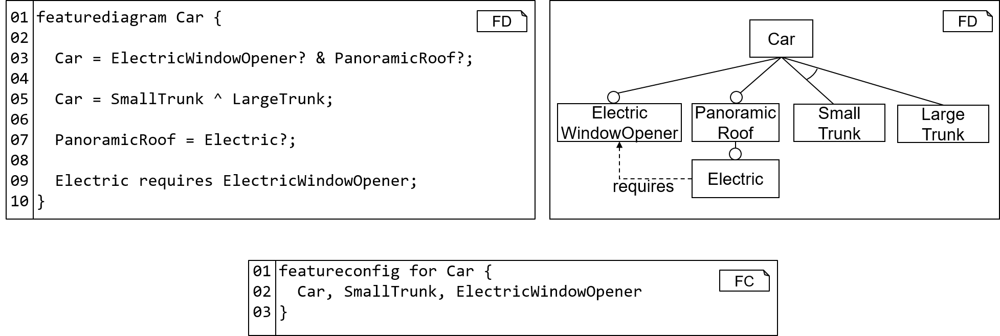

<!-- (c) https://github.com/MontiCore/monticore -->
[tool]:                      ../../../../../../../../fd-analysis/src/main/java/mcfdtool/FeatureModelAnalysisTool.java
[clitool]:                   ../../../../../../../../fd-analysis/src/main/java/mcfdtool/FACT.java
[FDtool]:                    ../../../../../../../../fd-lang/src/main/java/de/monticore/featurediagram/FeatureDiagramTool.java
[FCtool]:                    ../../../../../../../../fd-lang/src/main/java/de/monticore/featureconfiguration/FeatureConfigurationTool.java


[flatzinc]: https://www.minizinc.org/doc-2.4.3/en/flattening.html
[choco]: https://choco-solver.org
> NOTE: <br>
This documentation is intended for  **modelers** who use the feature diagram languages.
The documentation for **language engineers** using or extending the feature diagram language is 
located **[here](fd-lang/src/main/grammars/de/monticore/FeatureDiagram.md)** and the
documentation for using 
or extending the feature configuration language is located 
**[here](fd-lang/src/main/grammars/de/monticore/FeatureConfiguration.md)**.

# Feature Diagram Languages in MontiCore

The models of the feature diagram language (FDL) are called *feature diagrams (FDs)*. Sometimes
the term feature model is used interchangeably. 
An FD describes a software or system family in terms of 
(user-experienceable) features. FDs are used as variability models in
the context of software product lines. 
This documentation does not provide a general holistic introduction to FDs
and their applications, as this is provided by several books (e.g., 
[[CE00]](https://dl.acm.org/doi/book/10.5555/345203), 
[[CN02]](https://dl.acm.org/doi/book/10.5555/501065)) and 
research papers (e.g., 
[[BSL+13]](http://citeseerx.ist.psu.edu/viewdoc/download?doi=10.1.1.650.9121&rep=rep1&type=pdf), 
[[KCH+90]](https://apps.dtic.mil/dtic/tr/fulltext/u2/a235785.pdf)).

Instead, the purpose of this documentation is to 
introduce the [textual syntax](#textual-syntax), 
describe the [feature analyses](#feature-analyses) that our FD tool provides, and 
support setting up the tool in form of a short [tutorial](#tool-usage-documentation).

## Textual Syntax
This section presents two examples for FDs: The phone example gives an overview
over the textual syntax while the CarNavigation presents all syntax elements of the language.

Each FD has a name and a body that is surrounded by curly brackets.
The body contains rules that define the feature tree. Each rule describes a 
feature group with a parent feature (left-hand side) followed by an arrow 
(`->`) and children features (right-hand side). 
The root of the feature tree is detected automatically. 
Further, an FD may define cross-tree constraints
and use Java-like expressions to formulate these.

###### Phone Example 
Fig. 1 presents the textual and graphical syntax of an example FD 
describing a product line of phones.
As in Java, each FD can be located in a package to enable a hierarchical
name space of feature diagrams. Omitting the package statement 
defaults to an empty package.

<div align="center">

<br><b>Figure 1:</b> 
Example for the textual syntax of an FD (left) and its visual 
representation (right). The bottom demonstrates the syntax of a feature
configuration by example.
</div><br>


The content of the FD begins with the keyword `featurediagram` followed 
by the FD's name (l. 3) and the FD body, enclosed by curly 
braces. 
The body of an FD must contain a statement introducing the root feature (l. 4).
Further, it can introduce subfeatures through feature groups (ll. 5-9) and 
cross-tree constraints (ll.11-12).

Feature configurations start with the keyword `featureconfig` followed by an optional
name of the feature configuration. Afterward, the feature configuration has to 
indicate, which FD it belongs to. This begins with the keyword `for`, followed
by the (qualified) name of the FD.
The body of the feature configuration, enclosed in curly braces, contains a comma-separated
list of selected feature names. 
Please note that this syntax for feature configurations does not distinguish between 
features that are not selected (yet) and features, which are "unselected". To this end, 
a different feature configuration language has to be employed, e.g., to model step-wise configuration
of FDs.

###### CarNavigation Example 

```
/* (c) https://github.com/MontiCore/monticore */
featurediagram CarNavigation {

  CarNavigation -> Display & GPS & PreinstalledMaps? & Memory ; //and group

  CarNavigation -> VoiceControl ^ TouchControl; //xor group

  Memory -> Small ^ Medium ^ Large ;

  Display -> SmallScreen | LargeScreen; //or group

  PreinstalledMaps -> [1..3] of {Europe, NorthAmerica, SouthAmerica, Asia, Africa}; //cardinality group

  TouchControl requires LargeScreen ;

  SmallScreen  excludes TouchControl ;

  (Europe && NorthAmerica && Asia) requires (Large || Medium) ;

}
``` 
The listing above presents the FD `CarNavigation` with the root
feature also named `CarNavigation`. This feature has three mandatory
subfeatures `Display`, `GPS`, and `Memory`. Further, it
has the optional subfeature `PreinstalledMaps`, indicated by the question 
mark in the and group. Besides these four subfeatures, `CarNavigation` has
two further subfeatures `VoiceControl` and `TouchControl`that are in an 
xor group, which means that each configuration must contain exactly one of 
these two features.
Groups can have arbitrary members. For instance, `Memory` has three
subfeatures `Small`, `Medium`, and `Large` that are in a common xor group.
The `Display` of the navigation must have either a `SmallScreen` behin the 
steering wheel or a `LargeScreen` (e.g., in the center of the dashobard),
or both. This is realized as an or group in the FD. 
Further, the navigation system can have preinstalled maps. If maps are preinstalled,
at least one and at most three region maps can be selected. 
The available regions are `Europe`, `NorthAmerica`, `SouthAmerica`, `Asia`, and 
`Africa`.

The FD further contains three cross-tree constraints. Selecting 
`TouchControl` in a configuration requires also to select `LargeScreen` for
this configuration. On the other hand, selecting `SmallScreen` in a configuration
prohibits selecting `TouchControl` in the same configuration as well. 
Apart from these constraints between two features, FDs may contain
more complex constraints that involve more than two features. In the example 
FD below, selecting all three preinstalled maps  `Europe`, `NorthAmerica`, 
and `Asia` requires to select either a `Large` or a `Medium` memory.


## Feature Analyses

FDs and feature configurations can be analyzed to extract information
about the software product line and its products.
An overview of the different analyses is given by [[BSRC10]](https://doi.org/10.1016/j.is.2010.01.001).
The following table shows the analyses currently implemented in the FD analysis tool:

| name | input | result |
| ------ | ------ | ------ |
| [all products](fd-analysis/src/main/java/tool/analyses/AllProducts.java) | FD | list of feature configurations |
| [dead features](fd-analysis/src/main/java/tool/analyses/DeadFeatures.java) | FD | list of features |
| [false optional features](fd-analysis/src/main/java/tool/analyses/FalseOptional.java) | FD | list of features |
| [filter](fd-analysis/src/main/java/tool/analyses/Filter.java) | FD & feature configuration | list of feature configurations |
| [find valid product](fd-analysis/src/main/java/tool/analyses/FindValidConfig.java) | FD | feature configuration |
| [is valid](fd-analysis/src/main/java/tool/analyses/IsValid.java)| FD & feature configuration | boolean |
| [is void](fd-analysis/src/main/java/tool/analyses/IsVoidFeatureModel.java) | FD | boolean |
| [number of products](fd-analysis/src/main/java/tool/analyses/NumberOfProducts.java) | FD | integer |

## Tools (new)
The FDL component provides the following three tools:

### [The FeatureModelAnalysisCLITool][clitool] 

The [FeatureModelAnalysisCLITool][clitool] coordinates the execution of one or more several analyses against a FD
and, optionally, additional information (depends on the analysis kinds) in form of a CLI tool. It can be used as follows:
```java -jar FACT.jar <Car.fd> [-<analysis>]+```, where
* `<Car.fd>` is the (optionally, qualified) fileName of an FD "Car"
* `<analysis>` is the name of an analysis followed by arguments for the analysis that depend on the type of analysis.

Currently, the FeatureModelAnalysisCLITool supports the following analyses:
* `isValid <Basic.fc>`, the check whether a passed configuration "Basic" is valid w.r.t the FD.

For example, `java -jar FACT.jar Car.fd -isValid Basic.fc` checks whether a configuration "Basic" is a valid configuration of the FD "Car". 
The result, in this case `true` or `false`, is printed to the console.


### [The FeatureModelAnalysisTool][tool] 
The [FeatureModelAnalysisTool][tool] coordinates the execution of one or more analyses against a FD
and, optionally, additional information (depends on the analysis kinds) such as a feature configuration, in form of a Java API.
It contains the following constructors and methods:
* `FeatureModelAnalysisTool(ASTFeatureDiagram featureModel, ISolver solver)` instantiates the tool with the AST of the passed 
  featureModel and uses the passed solver for conducting the analses.
* `FeatureModelAnalysisTool(ASTFeatureDiagram featureModel)` instantiates the tool with the AST of the passed featureModel. By default, a Solver based on [Choco][choco] is employed.
* `void addAnalysis(Analysis analysis)` adds an analysis to the set of analyses conducted in this tool. Arguments for the analysis have to be added to each analysis object individually. 
* `void performAnalyses()` performs the analyses. The analysis results are then available in each Analysis object

### [The FeatureDiagramTool][FDtool] 
The [FeatureDiagramTool][FDtool] offers a Java API for processing FeatureDiagram models. 
It contains the following (static) methods:
* `ASTFDCompilationUnit parse(String modelFile)` processes the model at the passed path and produces an AST
* `FeatureDiagramArtifactScope createSymbolTable(String modelFile, ModelPath mp)` parses the model at the passed path and 
  instantiates the symbol table using passed modelpath entries for finding imported FDs
* `FeatureDiagramArtifactScope createSymbolTable(ASTFDCompilationUnit ast, ModelPath mp)` instantiates the symbol table 
  using the passed AST as basis and the passed modelpath entries for finding imported FDs
* `void checkCoCos(ASTFDCompilationUnit ast)` checks all context conditions of the FDL against the passed AST
* `File storeSymbols(ASTFDCompilationUnit ast, String fileName)` stores the symbol table for the passed ast in a file with the path fileName. 
  If the file exists, it is overridden. Otherwise, a new file is created.
* `ASTFeatureDiagram run(String modelFile, ModelPath mp)` parses the passed modelFile, creates the symbol table, 
  checks the context conditions, and then stores the symbol table.
* `ASTFeatureDiagram run(String modelFile)` parses the passed modelFile, creates the symbol table, checks the context conditions, and stores symbol table - all
  without an explicit modelpath. Care: this can only take into account imported FDs if these are located next to the passed FD modelFile.


## Further Information

* [Project root: MontiCore @github](https://github.com/MontiCore/monticore)
* [MontiCore documentation](http://www.monticore.de/)

* [**List of languages**](https://git.rwth-aachen.de/monticore/monticore/-/blob/dev/docs/Languages.md)
* [**MontiCore Core Grammar Library**](https://git.rwth-aachen.de/monticore/monticore/blob/dev/monticore-grammar/src/main/grammars/de/monticore/Grammars.md)
* [Best Practices](BestPractices.md)
* [Publications about MBSE and MontiCore](https://www.se-rwth.de/publications/)

* [Licence definition](https://github.com/MontiCore/monticore/blob/master/00.org/Licenses/LICENSE-MONTICORE-3-LEVEL.md)

