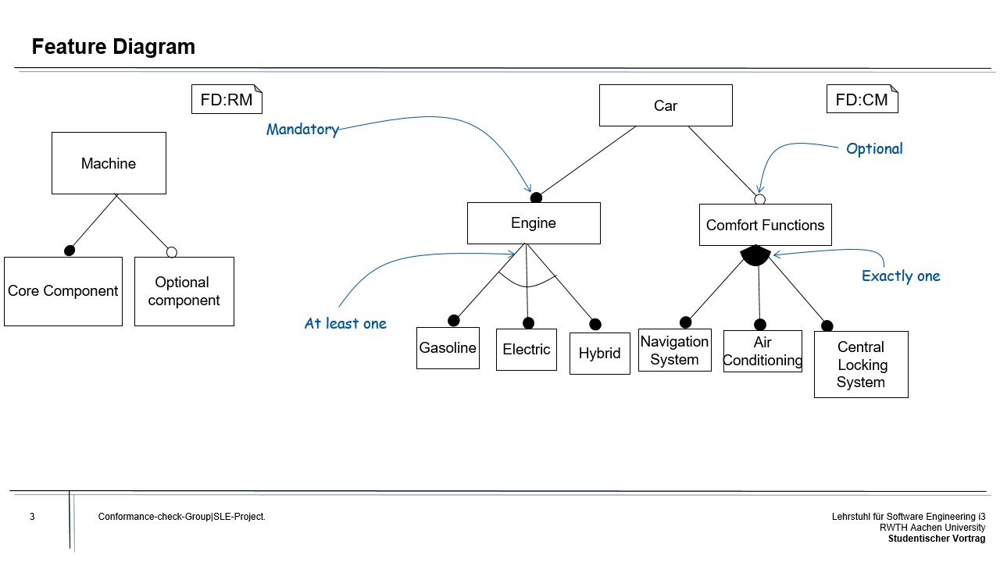
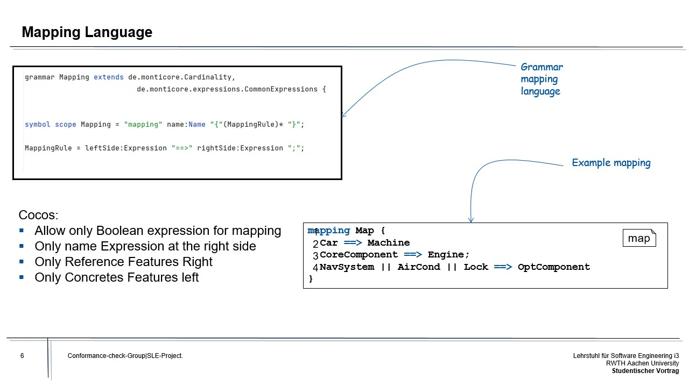
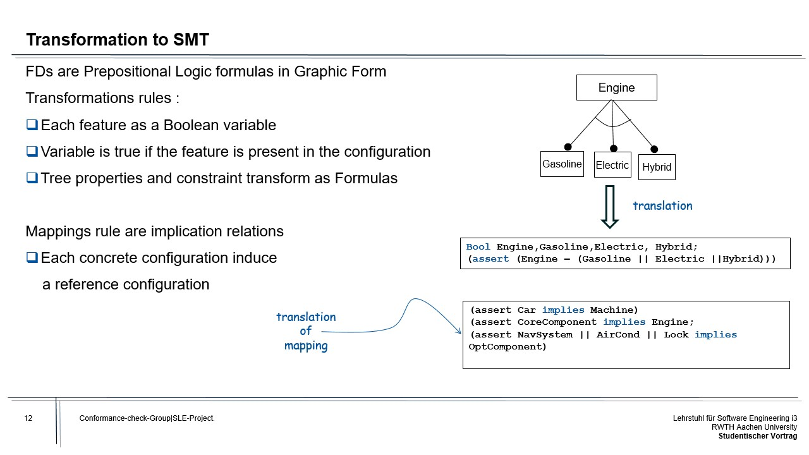
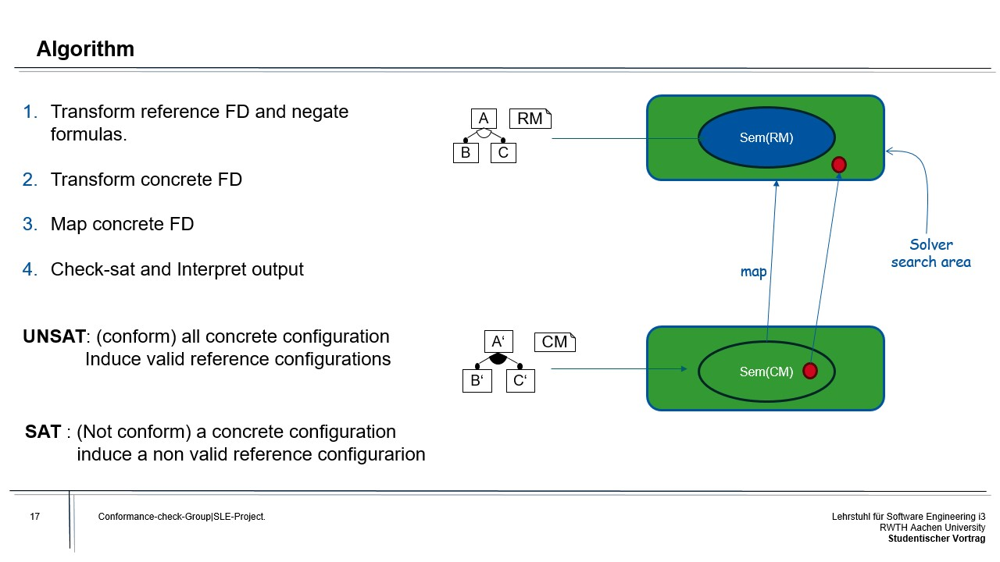
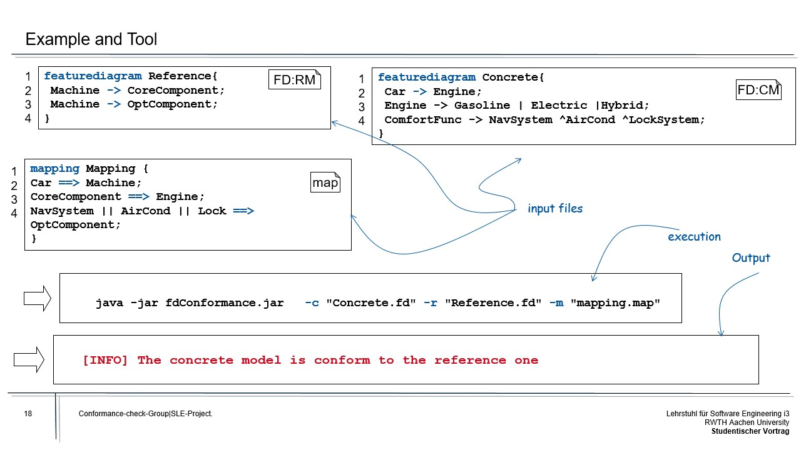
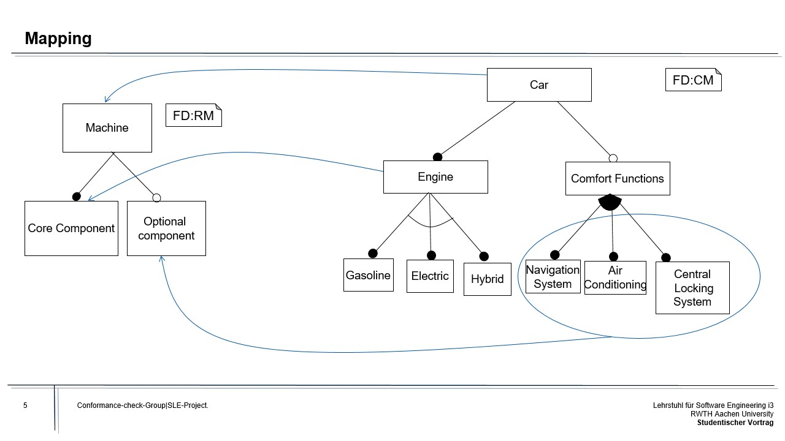

##### Foreword:
The primary focus of this project revolves around Conformance Checking for Feature Diagrams. Our objective is to evaluate the conformity between a reference model and a concrete model. Furthermore, we present a step-by-step procedure along with the solution we devised to address any challenges encountered during the process.

## Contents
- Reference Model
- Feature Diagram
- Example
- Conformance relation and checking
- Mapping
- Approach for conformance check
- Transformation to SMT
- Algorithm (Solution)

## Reference Model 
A reference model in systems, enterprise, and software engineering refers to a model expressed in a specific language. It serves the purpose of illustrating a collection of domain concepts along with their domain-specific relationships. Additionally, it includes a conformance relation that accurately identifies the group of models that adhere to the same language.
In our project we represent reference models as feature diagrams.

## Feature Diagrams

Feature diagrams, also referred to as feature models, are the models within the feature diagram language. They serve as descriptions of software or system families, focusing on features that can be experienced by users. Feature Diagrams are commonly utilized as variability models in software product lines. Feature configurations play a crucial role in this context as they select specific features from a feature diagram and define a product or variant within the product lines.
 
#### Example:

  

  ## Conformance Relation and Checking

The __conformance relation__ between two models A, B
is a binary, reflexive, transitive relation that
describes whether concrete model B is a concretization of reference model A.

The __conformance check__ verifies whether the concrete model (CM) is a refinement of the reference model (RM).

Due to the potential variance in names, a direct comparison between __sem(rm)__ and __sem(cm)__ is not feasible.

## Mapping

In feature diagrams, mapping refers to the process of establishing a relationship between concrete models and reference models. Concrete models represent specific instances or implementations of a system, while reference models represent an abstract representation of the system's features and behavior. Mapping allows you to relate the features in concrete models to the corresponding features in the reference model.

Mapping in feature diagrams is applied by comparing the features present in concrete models with the features defined in the reference model. By identifying similarities and equivalences between the features, mapping relationships are established to relate the specific implementations in the concrete models to the desired or abstract representation in the reference model. This process helps in capturing and documenting the correspondence between the concrete and reference models, aiding in the validation and verification of the concrete models against the desired system representation.

## Conformance Checks "Approach"

__Input:__

- Reference FD 
- Concrete FD 
- Mapping

__Approach:__

- Reduce  the problem to a Satisfiability Problem (SMT) .
- Define the problem using SMT language, which allows writing First-Order Logic formulas.
- Utilize the Z3 solver, a powerful tool for solving SMT formulas, to find values for variables that satisfy the formulas.

__Output:__

- If the concrete FD conforms to the reference FD and mapping, return "true" along with a witness configuration that satisfies the conditions.
- If the concrete FD does not conform to the reference FD and mapping, return an indication that it is not conforming.

__What is that?__
- SMT is a language used to write formulas in First-Order Logic.

__Z3:__

- Z3 is a solver that can handle SMT formulas and find values for variables that make the formulas satisfiable.

By following this revised design, you can leverage SMT and the Z3 solver to efficiently determine the conformance of the concrete FD to the reference FD and mapping.

## _Transformation to SMT_

FDs are prepositional logic formulas in Graphic Form.

Transformations rules :
- [ ] Each feature as a Boolean variable
- [ ] Variable is true if the feature is present in the configuration
- [ ] Tree properties and constraint transform as Formulas

## Algorithm:

## Motivating EXAMPLE:

In Figure 1, we illustrate a valid conformance relation for the feature diagram. A tree structure on the left side is an implementation of a reference model. This reference model describes a concept and the necessary components for a machine.
First, we need a machine name as root. In this case, it’s a machine. The root has two children, the ‘core Component’ and ‘Optional Component’.  For a valid structure, a machine must have a ‘core Component’ but an ‘Optional Component’ is optional, so the machine can have several or none optional parts.
The tree on the right side is also the feature diagram with an example of a concrete model of a car component.  The car must have an Engine, which could be a gasoline, electric, or hybrid engine. For better habitability, the car can have other optional parts, such as a navigation system, an air conditioner, central locking system.
As we can see, reference and concrete models have a similar tree structure. Both models have compulsory parts and optional parts, which means the concrete model has similar associations as the reference model.
However, we can't be judged for conformance yet.
For a valid conformance relation, we need to describe how our mapping works. The Arrow from right to left is a mapping, and each element from the concrete model must be stated to an element on the reference model.
So, in this example, we state all rules.  The mapping is valid, and there is a conformance relation between a concrete and reference model.

 
