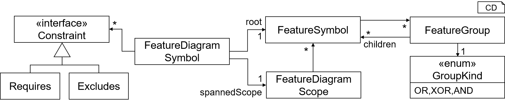

<!-- (c) https://github.com/MontiCore/monticore -->

<!-- List with all references used within this markdown file: -->
[Readme]: ../../../../README.md
[Grammar]: FeatureDiagram.mc4
[fdstc]: ../java/featurediagram/_symboltable/FeatureDiagramSymbolTableCreator.java
[HasTreeShape]: ../java/featurediagram/_cocos/HasTreeShape.java
[CTCFeatureNamesExist]: ../java/featurediagram/_cocos/CTCFeatureNamesExist.java
[NonUniqueNameInGroup]: ../java/featurediagram/_cocos/NonUniqueNameInGroup.java
[flatzinc]: https://www.minizinc.org/doc-2.4.3/en/flattening.html

[AllProducts]: https://git.rwth-aachen.de/monticore/languages/feature-diagram/-/blob/develop/fd-analysis/src/main/java/tool/analyses/AllProducts.java
[CompleteToValid]: https://git.rwth-aachen.de/monticore/languages/feature-diagram/-/blob/develop/fd-analysis/src/main/java/tool/analyses/CompleteToValidConfig.java
[DeadFeature]: https://git.rwth-aachen.de/monticore/languages/feature-diagram/-/blob/develop/fd-analysis/src/main/java/tool/analyses/DeadFeature.java
[FalseOptional]: https://git.rwth-aachen.de/monticore/languages/feature-diagram/-/blob/develop/fd-analysis/src/main/java/tool/analyses/FalseOptional.java
[IsValid]: https://git.rwth-aachen.de/monticore/languages/feature-diagram/-/blob/develop/fd-analysis/src/main/java/tool/analyses/IsValid.java
[IsVoid]: https://git.rwth-aachen.de/monticore/languages/feature-diagram/-/blob/develop/fd-analysis/src/main/java/tool/analyses/IsVoidFeatureModel.java
[NumberOfProducts]: https://git.rwth-aachen.de/monticore/languages/feature-diagram/-/blob/develop/fd-analysis/src/main/java/tool/analyses/NumberOfProducts.java

[generator]: https://git.rwth-aachen.de/monticore/languages/feature-diagram/-/blob/develop/fd-analysis/src/main/java/tool/analyses
[tool]: https://git.rwth-aachen.de/monticore/languages/feature-diagram/-/blob/develop/fd-analysis/src/main/java/tool/FeatureModelAnalysisTool.java


<!-- The following references should point towards the markdown files, once these exist -->
[Cardinality MLC]: https://git.rwth-aachen.de/monticore/monticore/-/blob/dev/monticore-grammar/src/main/grammars/de/monticore/Cardinality.mc4
[MCBasicTypes MLC]: https://git.rwth-aachen.de/monticore/monticore/-/blob/dev/monticore-grammar/src/main/grammars/de/monticore/types/MCBasicTypes.mc4
[FeatureConfiguration MLC]: FeatureConfiguration.md

> NOTE: <br>
This documentation is intended for  **language engineers** who use the feature diagram language.
The documentation for **modelers** is located **[here][Readme]**. 

# MontiCore Feature Diagram Language

[[_TOC_]]

The following documents a feature diagram language engineered with MontiCore. 
The purpose of the language is to represent feature models used in product line engineering. 
The language is extensible to tailor it for various different applications.

Many notational and semantic variations of the original feature diagrams
as presented in [[KCH+90]](https://apps.dtic.mil/dtic/tr/fulltext/u2/a235785.pdf)
have been developed. This language uses feature models with the following characteristics:
* Each feature diagram must have a root feature
* A feature may not be member of more than one feature group
* The supported kinds of groups are: 
    * usual "is child of" (ANDGroup)
    * alternative features (XORGroup)
    * selection of features (ORGroup)
    * lower and upper bound for number of selected features (CardinalityGroup)
* Cross tree constraints are only binary relations between two features in which either:
    * a feature excludes another feature
    * a feature requires another feature
* Obligation or optionality of a feature in any group except ANDGroup is discarded. 
All features that are members of such groups are regarded as optional features

## Syntax

The syntax of the feature diagram language is specified through the feature model 
[grammar](#grammar), some handwritten extensions of the 
[abstract syntax](#handwritten-ast-&-symbol-table-classes), and the 
[context conditions](#context-conditions).

### Grammar
The **[FeatureDiagram grammar][Grammar]** describes the syntax
of feature models. The grammar itself is a good documentation of the concrete and abstract syntax of 
feature models. Design decisions are documented inline. 

The grammar contains several extension points that can be used to tailor the language to 
different applications. For instance, it is possible to add feature attributes.

* The interface nonterminal **FDElement** can be implemented to add further 
elements to the feature diagram's body.
* The interface nonterminal **FeatureGroup** can be implemented to add further 
kinds of feature groups. However, each implementation must contain a (non-empty)
iteration of 'Feature' nonterminals. Please note, that these should be added to
the *GroupKind* enumeration in the symbol table as well.
* The interface nonterminal **ConstraintExpression** can be implemented to add further
syntax for cross-tree constraints. 

### Handwritten AST & Symbol Table Classes
The AST data structure has not been customized with any handwritten extensions to the generated classes.

The symbol table data structure has been extended with several handwritten classes as described in the 
following:

* The `FeatureDiagramSymbol` has been extended with the TOP mechanism. For convenience, we added a 
method for retrieving all features contained in the feature diagram.
* FeatureSymbols contain a list of `FeatureGroup`. Feature groups have a `GroupKind` that is either
`AND`, `XOR`, or `OR`. A feature group has children in form of a list of feature symbols.
Feature groups are instantiated during symbol table creation in the (handwritten) class
`FeatureDiagramSymbolTableCreator`.

<div align="center">

<br>
<b>Figure 1:</b>Symbol Table Data Structure
</div>
<br>

The symbol table is instantiated by the class [FeatureDiagramSymbolTableCreator][fdstc]. Functionality to load and store 
feature diagram symbol tables is implemented as well.

### Symboltable
- (aus CD4A, TODO) De-/Serialization functionality for the symbol table 
  ([`serialization`][serialization])

### Symbol kinds used by Feature Diagrams (importable):
- @AB TODO: List of Symbol types + short explanations, zB:
- A feature diagram (as defined here) does not import any symbols; it defines all features locally.
- It also doesn't import classes, variables or other symbols.

### Symbol kinds defined by CD4A (exported):
- @AB TODO: List of Symbol types + short explanations, zB:
- FD defines its own type of FeatureSymbols.
- A featureSymbol is defined as:
  ```
  class FeatureSymbol {
      String name;
      ...
  }
  ```

### Symbols exported by CD4A:
- A feature diagram exports its feature symbols for external reference.
- The symbols of a feature diagram "F.fd" are stored in "F.fdsym".


### Context Conditions

| CoCo defined in class   | Error Code | Explanation |
| ---      |  ------  |---------|
| [HasTreeShape][HasTreeShape]                 | 0xFD0001 | Feature diagrams must not contain more than one root feature. |
| (see above)                                  | 0xFD0002 | Feature diagrams must not contain more than one root feature. |
| (see above)                                  | 0xFD0003 | Feature diagrams must contain a root feature. |
| (see above)                                  | 0xFD0007 | Feature diagram rules must not introduce self loops. | 
| (see above)                                  | 0xFD0008 | Each feature except the root feature must have a parent feature. | 
| (see above)                                  | 0xFD0010 | The parent feature does not exist.  |
| [CTCFeatureNamesExist][CTCFeatureNamesExist] | 0xFD0006 | A cross-tree constraint must operate on features that are available in the current feature model. |
| [NonUniqueNameInGroup][NonUniqueNameInGroup] | 0xFD0009 | A Feature group must not contain a feature more than once. |

## Generator

* For minimal use: This language component provides a generator that translates feature models to 
[FlatZinc][flatzinc] models. FlatZinc, as part of MiniZinc, is a modeling language
enabling to model constraint satisfaction (and optimization) problems. Different
constraint solvers support FlatZinc as input format. The generator is located [here][generator].

## Tool

The feature model language component provides the [FeatureModelAnalysisTool][tool],
which coordinates the execution of one or more several analyses against a featurre model
and, optionally, additional information (depends on the analysis kinds).

### Supported Feature Analyses

| Analysis Class | Input | Result | Explanation |
| ---    | ---      |  ------  |---------|
| [AllProducts][AllProducts]           | FM m | Set\<String\> | Returns all valid FCs in m |
| [CompleteToValid][CompleteToValid]   | FM m, FC c | Optional\<FC\> | Can c be completed to a valid FC of m? If yes, return one example. |
| [DeadFeatures][DeadFeature]           | FM m | Set\<String\> | Set of features that are contained in m, but in no valid FC of m uses them. |
| [FalseOptional][FalseOptional]       | FM m | Set\<String\> | Set of features that are optional in m, but are contained in all valid FCs of m. |
| [IsValid][IsValid]                   | FM m, FC c | Boolean | Is c a valid FC in m? |
| [IsVoid][IsVoid]                     | FM m | Boolean | Is there a valid FC in m? |
| [NumberOfProducts][NumberOfProducts] | FM m | int | Returns the number of valid FCs in m. |

## Related Language Components
* This language component uses the language component **[de.monticore.Cardinality][Cardinality MLC]**
* This language component uses the language component **[de.monticore.types.MCBasicTypes][MCBasicTypes MLC]**
* This language component can be used in combination with the language component **[FeatureConfiguration][FeatureConfiguration MLC]**
* There are language components for partial configurations of feature models and for feature models with attributes

  
<!--
  - Was sind die wichtigsten (handgeschriebenen) internen Funktionalitäten 

    (Funktionen, die auf der abstrakten Syntax Informationen berechnen oder die abstrakte Syntax modifizieren), 

    z.B. Trafos, Symboltabellenberechnungen, CoCo checks

  - Welche Erweiterungspunkte für die Syntax sind vorgesehen? 

    (z.B. in Form von Top-Mechanismus/Pattern zur Erweiterung)

  - Welche Generatorfunktionalitäten existieren?

    (z.B. PrettyPrinter)

  - Welche Erweiterungspunkte für Generatoren sind vorgesehen?
-->
